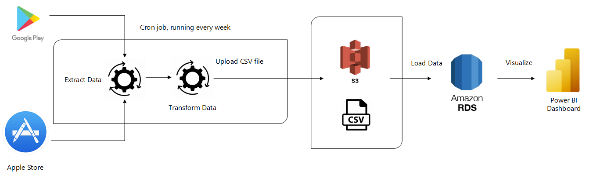

# Google Play and Apple Store Reviews Scraper

#### Project Statement
A fintech company has been receiving more negative ratings for consecutive months. They wanted to know what their users had to say about their application.

A natural language processing (NLP) solution was proposed, with the first phase being the creation of a data pipeline for collecting data from several mobile app vendors. 

#### Project Design

For our project, we will pull customer reviews from Google Play and Apple Store. Extraction is scheduled every week and is loaded into our data warehouse. The data is then visualized for the usage of our stakeholders.

##### Prerequisites:
1.) AWS account
  2.) AWS CLI installed and configured
  3.) Python
  4.) Power BI (Optional)
